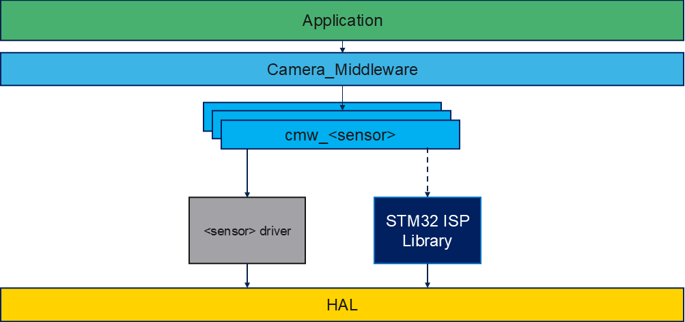

# How to add a new sensor in `stm32-mw-camera`

This guide describes how to add a new sensor to the Camera Middleware (`CMW`).

## Table of content

- [Understand the integration](#understand-the-integration)
- [1. Create sensor driver adaptation layer.](#1-create-sensor-driver-adaptation-layer)
- [2. Implement adaptation layer](#2-implement-adaptation-layer)
  - [2.1 Use the provided template files](#21-use-the-provided-template-files)
  - [2.2 Implement mandatory functions.](#22-implement-mandatory-functions)
  - [2.3 Mandatory vs optional callbacks](#23-mandatory-vs-optional-callbacks)
- [3. Register the sensor in middleware registry](#3-register-the-sensor-in-middleware-registry)
  - [3.1 Update `cmw_sensor_registry.h`](#31-update-cmw_sensor_registryh)
  - [3.2 Update `cmw_sensor_registry.c`](#32-update-cmw_sensor_registryc)
- [4. Enable the sensor macro in application config](#4-enable-the-sensor-macro-in-application-config)
- [5. Build and project integration](#5-build-and-project-integration)
  - [5.1 Source inclusion](#51-source-inclusion)
  - [5.2 Include paths](#52-include-paths)
- [6. ISP dependencies (RAW Bayer sensors)](#6-isp-dependencies-raw-bayer-sensors)
  - [6.1 When is the ISP needed?](#61-when-is-the-isp-needed)
  - [6.2 Compile switch `CMW_USE_WITHOUT_ISP`](#62-compile-switch-use_without_isp)
  - [6.3 ISP call flow in the adaptation layer](#63-isp-call-flow-in-the-adaptation-layer)
  - [6.4 Tuning (IQ) parameter files](#64-tuning-iq-parameter-files)
  - [6.5 ISP sources and include paths](#65-isp-sources-and-include-paths)
- [7. Application usage example](#7-application-usage-example)
- [8. Validation checklist](#8-validation-checklist)
- [9. Practical tips](#9-practical-tips)

---

## Understand the integration



Each sensor has its own cmw_<sensor> component which is an adaptation layer for the `cmw_camera.c`

CMW discovers and uses sensors through this struct:

```c
// Each sensor driver should provide an instance of this struct
typedef struct {
  const char *name;
  int32_t (*init)(CMW_Sensor_if_t *camera_drv, void *sensor_ctx,  DCMIPP_HandleTypeDef *hdcmipp, CMW_Sensor_Init_t *initSensors_params, void *p_appliHelpers_ISP);
  void  (*set_defaultSensorValues)(void *sensor_config);
  void *sensor_ctx; // Sensor-specific context
} camera_sensor_t;
```

The init function returns a sensor interface (`CMW_Sensor_if_t`) containing function pointer that is used by the cmw_camera.c.

The instances of this struct are declared in [cmw_sensor_registry.c](../cmw_sensor_registry.c) for each sensor.

- Example context struct
```c
typedef struct
{
  uint16_t Address;
  uint32_t ClockInHz;
#if !defined (CMW_USE_WITHOUT_ISP)
  ISP_HandleTypeDef hIsp;
#endif
  DCMIPP_HandleTypeDef *hdcmipp;
  uint8_t IsInitialized;
  int32_t (*Init)(void);
  int32_t (*DeInit)(void);
  int32_t (*WriteReg)(uint16_t, uint16_t, uint8_t*, uint16_t);
  int32_t (*ReadReg)(uint16_t, uint16_t, uint8_t*, uint16_t);
  int32_t (*GetTick)(void);
  void (*Delay)(uint32_t delay_in_ms);
  void (*ShutdownPin)(int value);
  void (*EnablePin)(int value);

  /* Vendor driver object goes here, for example:
   * SENSORNAME_Object_t ctx_driver;
   */
} CMW_SENSORNAME_t;
```

- Prototypes Adaptation layer init function:

```c
  /**
  * @brief  Initialize the sensor and return a common interface for the Camera Middleware
  * All pointers are allocated by cmw_camera.c
  * @param  camera_drv  pointer to the sensor APIs
  * @param  sensor_ctx  pointer to context functions (CMW_SENSORNAME_t in this example)
  * @param  hdcmipp  pointer to the dcmipp instance managed by cmw_camera
  * @param  initSensors_params Init parameters
  * @param  p_appliHelpers_ISP application-provided ISP helpers (may be NULL when ISP is not used)
  * @retval Component status
  */
  int32_t CMW_CAMERA_SENSORNAME_Init(CMW_Sensor_if_t *camera_drv, void *sensor_ctx, DCMIPP_HandleTypeDef *hdcmipp, CMW_Sensor_Init_t *initSensors_params, void *p_appliHelpers_ISP)
```

Nota: The common sensor interface `CMW_Sensor_if_t` is defined in [cmw_sensors_if.h](../sensors/cmw_sensors_if.h).

- Default config function:

```c
  /**
  * @brief  Set Default parameters for the given sensor
  * @param  sensor_config sensor config to fill (type: CMW_SENSORNAME_config_t)
  * @retval Component status
  */
	void CMW_SENSORNAME_SetDefaultSensorValues(void *sensor_config)
```

Nota: All those prototypes are in the [cmw_sensor_template.h](../sensors/cmw_sensor_template.h). You can find real example in the existing sensors.

Your sensor needs to be register in:

- `cmw_sensor_registry.h`
- `cmw_sensor_registry.c`

A compile-time sensor macro in application config:

- `USE_SENSORNAME_SENSOR` in `cmw_camera_conf.h` (template `cmw_camera_conf_template.h` is provided)

---

The following sections is a step-by-step proposal to implement your `cmw_<sensorname>.{h/c}`. You can as well choose to copy an existing cmw_sensor and adapt it.

- If you do so, you can choose the one the closest to your needs:
  - RAW Bayer + ISP: `cmw_imx335` or `cmw_vd66gy`
  - RGB/YUV no ISP usage: `cmw_ov5640`

## 1. Create sensor driver adaptation layer.

Copy paste the template and rename:

- `sensors/cmw_sensor_template.h` -> `Inc/cmw_<your sensor name>.h`
- `sensors/cmw_sensor_template.c` -> `Src/cmw_<your sensor name>.c`
- vendor/component sources in `sensors/<sensor>/...`

Nota: You can directly implement your driver in `sensors/cmw_sensor.c` if you don't want to distinguish driver and adaptation layer.

You can as well use one existing driver as example:

  - RAW Bayer + ISP: `cmw_imx335` or `cmw_vd66gy`
  - RGB/YUV no ISP usage: `cmw_ov5640`

## 2. Implement adaptation layer

The source template already contains all major middleware blocks and call flow.

This table summarizes the API functions to implement:

| Function Name                                 | Description / Purpose                                                                                      | Mandatory / Optional |
|-----------------------------------------------|------------------------------------------------------------------------------------------------------------|---------------------|
| NEWSENSOR_VENDOR_RegisterBusIO                | Register bus IO callbacks for the sensor vendor driver                                                     | Mandatory           |
| NEWSENSOR_VENDOR_ReadID                       | Read sensor ID to verify presence                                                                          | Mandatory           |
| NEWSENSOR_VENDOR_Init                         | Initialize the sensor hardware                                                                             | Mandatory           |
| NEWSENSOR_VENDOR_Start                        | Start the sensor streaming                                                                                 | Mandatory           |
| NEWSENSOR_VENDOR_DeInit                       | De-initialize the sensor hardware                                                                          | Mandatory           |
| CMW_SENSORNAME_Probe                          | Power-on, bus bind, ID read, callback registration                                                         | Mandatory           |
| CMW_SENSORNAME_Init                           | Initialize the sensor, context, etc                                                                        | Mandatory           |
| CMW_SENSORNAME_Start                          | Start the sensor stream and the ISP MW if asked                                                            | Mandatory           |
| CMW_SENSORNAME_DeInit                         | De-initialize the sensor                                                                                   | Mandatory           |
| CMW_SENSORNAME_SetDefaultSensorValues         | Set default configuration values for the sensor (line length, pixel size...)                               | Mandatory           |
| CMW_CAMERA_SENSORNAME_Init                    | Entry point for Camera Middleware to initialize the sensor, call the probe and the internal init. Return CMW_ERROR_NONE if no issue to initialize the sensor                                                | Mandatory           |
| CMW_SENSORNAME_SetGain                        | Set sensor analog/digital gain                                                                             | Optional            |
| CMW_SENSORNAME_SetExposure                    | Set sensor exposure time                                                                                   | Optional            |
| CMW_SENSORNAME_SetExposureMode                | Set sensor exposure mode (auto/manual)                                                                     | Optional            |
| CMW_SENSORNAME_SetMirrorFlip                  | Set mirror/flip mode                                                                                       | Optional            |
| CMW_SENSORNAME_SetTestPattern                 | Enable/disable test pattern mode                                                                           | Optional            |
| CMW_SENSORNAME_Run                            | Start sensor run loop (if required)                                                                        | Optional            |
| CMW_SENSORNAME_VsyncEventCallback             | Callback for vertical sync event                                                                           | Optional            |
| CMW_SENSORNAME_FrameEventCallback             | Callback for frame event                                                                                   | Optional            |
| CMW_SENSORNAME_SetWBRefMode                   | Set white balance reference mode                                                                           | Optional            |
| CMW_SENSORNAME_ListWBRefModes                 | List available white balance reference modes                                                               | Optional            |

By default in the `cmw_sensor_template.c`, unsupported features return `CMW_ERROR_FEATURE_NOT_SUPPORTED`.

## 3. Register the sensor in middleware registry

### 3.1 Update `cmw_sensor_registry.h`

Add:

1. Include guard section:

```c
#ifdef USE_SENSORNAME_SENSOR
#include "cmw_sensorname.h"
#endif
```

2. Context union entry:

```c
#ifdef USE_SENSORNAME_SENSOR
CMW_SENSORNAME_t <sensor>_ctx;
#endif
```

### 3.2 Update `cmw_sensor_registry.c`

Add one entry in `cmw_sensor_registry[]`:

```c
#ifdef USE_SENSORNAME_SENSOR
{
  .name = "SENSORNAME",
  .init = CMW_CAMERA_SENSORNAME_Init,
  .set_defaultSensorValues = CMW_SENSORNAME_SetDefaultSensorValues,
  .sensor_ctx = &sensor_ctx.<sensor>_ctx
},
#endif
```

---

## 4. Enable the sensor macro in application config

`cmw_camera.h` includes `cmw_camera_conf.h` (provided by application, usually copied from `cmw_camera_conf_template.h`).

In your application `Inc/cmw_camera_conf.h`, add:

```c
#define USE_SENSORNAME_SENSOR
```

---

## 5. Build and project integration

### 5.1 Source inclusion

Ensure new files are compiled in your final application build:

- `Src/cmw_sensorname.c`
- any extra `Src/sensors/<sensor>/*.c`

For STM32CubeIDE application projects, linked resources may be explicitly listed in `.project`; 
if so, add your new files there (or re-import/regenerate project links).

### 5.2 Include paths

Ensure include paths contain:

- `Middlewares/stm32-mw-camera`
- `Middlewares/stm32-mw-camera/sensors`
- your new directory if new files are in a new folder.

---

## 6. ISP dependencies (RAW Bayer sensors)

RAW Bayer sensors output un-processed Bayer data. They rely on the **ISP Library**
(shipped in [../ISP_Library](../ISP_Library)) to perform demosaicing, auto-exposure (AE),
auto-white-balance (AWB), gamma, color correction, etc. RGB/YUV sensors (for example
`cmw_ov5640`) already output a displayable format and do **not** use the ISP.

### 6.1 When is the ISP needed?

| Sensor output          | ISP required | Reference driver         |
|------------------------|--------------|--------------------------|
| RAW Bayer (RAW8/10/12) | Yes          | `cmw_imx335`, `cmw_vd66gy` |
| RGB / YUV              | No           | `cmw_ov5640`             |

If your sensor is RAW Bayer, follow the steps below. If it outputs RGB/YUV you can skip
this whole section and build with the ISP disabled (see 6.2).

### 6.2 Compile switch `CMW_USE_WITHOUT_ISP`

ISP support is controlled by the `CMW_USE_WITHOUT_ISP` macro:

- **Not defined (default):** the ISP Library is compiled in and used.
- **Defined:** the ISP Library is excluded from the build.

Guard every ISP-related field, include and call in your adaptation layer with:

```c
#if !defined (CMW_USE_WITHOUT_ISP)
/* ISP handle, includes and calls */
#endif
```

This lets the same driver build in both configurations. See `cmw_vd66gy.c` / `cmw_vd66gy.h`
for a complete example.

### 6.3 ISP call flow in the adaptation layer

1. **Context and includes.** Store the ISP handle in your context struct and pull in the
   ISP headers:

   ```c
   /* cmw_sensorname.h */
   #if !defined (CMW_USE_WITHOUT_ISP)
   #include "isp_api.h"
   #endif

   typedef struct {
     ...
   #if !defined (CMW_USE_WITHOUT_ISP)
     ISP_HandleTypeDef hIsp;
   #endif
     DCMIPP_HandleTypeDef *hdcmipp;
     ...
   } CMW_SENSORNAME_t;
   ```

   ```c
   /* cmw_sensorname.c */
   #if !defined (CMW_USE_WITHOUT_ISP)
   #include "isp_param_conf.h"
   #endif
   ```

2. **Init.** In your internal `Init`, initialize the ISP after the vendor sensor is up.

   ```c
   #if !defined (CMW_USE_WITHOUT_ISP)
   ret = ISP_Init(&ctx->hIsp, ctx->hdcmipp, 0,
                  (ISP_AppliHelpersTypeDef *)p_appliHelpers_ISP,
                  &ISP_IQParamCacheInit_SENSORNAME);
   if (ret != ISP_OK)
     return CMW_ERROR_COMPONENT_FAILURE;
   #endif
   ```

   `p_appliHelpers_ISP` is built by `cmw_camera.c` and holds callbacks
   (`SetSensorGain` / `GetSensorGain` / `SetSensorExposure` / `GetSensorExposure` /
   `GetSensorInfo`). The ISP AE/AWB algorithms use them to drive your sensor, so your
   driver must implement the corresponding `SetGain` / `SetExposure` / gain/exposure
   accessors for auto-exposure and auto-white-balance to work.

3. **Start.** In your internal `Start` Start the ISP together with the sensor stream:

   ```c
   #if !defined (CMW_USE_WITHOUT_ISP)
   ret = ISP_Start(&ctx->hIsp);
   if (ret != ISP_OK)
     return CMW_ERROR_PERIPH_FAILURE;
   #endif
   ```

4. **Background processing.** The AE/AWB loop runs in `ISP_BackgroundProcess`, which must
   be called periodically. Wire it into your `Run` callback:

   ```c
   static int32_t CMW_SENSORNAME_Run(void *io_ctx)
   {
   #if !defined (CMW_USE_WITHOUT_ISP)
     if (ISP_BackgroundProcess(&ctx->hIsp) != ISP_OK)
       return CMW_ERROR_PERIPH_FAILURE;
   #endif
     return CMW_ERROR_NONE;
   }
   ```

   The application is then responsible for calling `CMW_CAMERA_Run()` regularly from its
   main loop (it dispatches to your `Run` callback).

5. **Statistics / frame events (optional but recommended).** In your Vsync/Frame event
   callbacks, feed the ISP with frame accounting and statistics, e.g.
   `ISP_IncMainFrameId`, `ISP_IncDumpFrameId`, `ISP_IncAncillaryFrameId`,
   `ISP_GatherStatistics` (see `cmw_vd66gy.c`).

6. **DeInit.** Release the ISP in your `DeInit`:

   ```c
   #if !defined (CMW_USE_WITHOUT_ISP)
   ret = ISP_DeInit(&ctx->hIsp);
   if (ret)
     return CMW_ERROR_COMPONENT_FAILURE;
   #endif
   ```

### 6.4 Tuning (IQ) parameter files

The last argument of `ISP_Init` is a pointer to a `const ISP_IQParamTypeDef` that carries
the Image Quality tuning for your sensor/module. For the existing sensor this is provided as header files in
[../ISP_Library/isp_param_conf](../ISP_Library/isp_param_conf), for example
`vd66gy_MiniLBox_isp_param_conf.h` which defines:

```c
static const ISP_IQParamTypeDef ISP_IQParamCacheInit_VD66GY = { ... };
```

Notes:

- Several variants may exist per sensor (different lens/module, e.g. `JudgeII`,
  `MiniLBox`, board-specific files). Pick or generate the one matching your hardware.
- The tuning files are selected/aggregated through an application-provided
  `isp_param_conf.h` header. A template is available at
  [../ISP_Library/isp/Inc/isp_param_conf_template.h](../ISP_Library/isp/Inc/isp_param_conf_template.h).
- Tuning is generated with the [STM32 ISP IQTune](https://www.st.com/en/development-tools/stm32-isp-iqtune.html).

### 6.5 ISP sources and include paths

When the ISP is enabled, add the ISP Library to your build:

- Sources: `Middlewares/stm32-mw-camera/ISP_Library/isp/Src/*.c`
- Include paths:
  - `Middlewares/stm32-mw-camera/ISP_Library/isp/Inc`
  - the directory containing your `isp_param_conf.h` and the sensor tuning header(s)

When building with `CMW_USE_WITHOUT_ISP`, these sources and paths are not required.

---

## 7. Application usage example

**Direct init your camera sensor**

```c
CMW_SENSORNAME_config_t sensor_cfg;
CMW_Advanced_Config_t adv = {
  .sensor_name = "SENSORNAME",
  .sensor_config = &sensor_cfg
};

CMW_CAMERA_SetDefaultSensorValues(&adv);

CMW_CameraInit_t cam = {
  .width = 0,  /* 0/0 means full sensor resolution */
  .height = 0,
  .fps = 30,
  .mirror_flip = CMW_MIRRORFLIP_NONE,
};

CMW_CAMERA_Init(&cam, &adv);
```

**Camera Probing**

```c
CMW_CameraInit_t cam = {
  .width = 0,  /* 0/0 means full sensor resolution */
  .height = 0,
  .fps = 30,
  .mirror_flip = CMW_MIRRORFLIP_NONE,
};

CMW_CAMERA_Init(&cam, NULL);
```

---

## 8. Validation checklist

- Build succeeds with `USE_SENSORNAME_SENSOR` enabled.
- `CMW_CAMERA_GetSensorName()` returns your sensor name.
- Init works both:
  - with explicit sensor name (`advanced_config->sensor_name`)
  - with auto-probe (`advanced_config == NULL`) if your sensor is physically connected and probe succeeds.
- Stream starts on selected pipe.
- Resolution/fps/pixel format combinations are validated and reject unsupported values.
- `CMW_CAMERA_DeInit()` cleanly stops/de-inits sensor.

---

## 9. Practical tips

- Start from the closest existing driver:
  - RAW Bayer + ISP: `cmw_imx335` or `cmw_vd66gy`
  - RGB/YUV no ISP usage: `cmw_ov5640`
  - Keep sensor-specific logic in `sensors/cmw_sensor_template.c`; keep middleware core (`cmw_camera.c`) unchanged whenever possible.
- Implement strict parameter checks early (resolution, pixel format, fps) to fail fast with `CMW_ERROR_WRONG_PARAM`.
